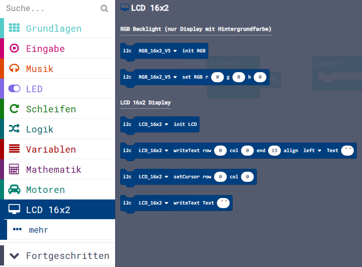

Diese Seite bei [https://calliope-net.github.io/lcd-16x2rgb/](https://calliope-net.github.io/lcd-16x2rgb/) öffnen.

### Calliope Erweiterung für die i2c Module:

* [Grove - 16x2 LCD](https://wiki.seeedstudio.com/Grove-16x2_LCD_Series/)

* [Grove - LCD RGB Backlight V5.0](https://wiki.seeedstudio.com/Grove-LCD_RGB_Backlight/)

Dieses Repository kann als **Erweiterung** in MakeCode hinzugefügt werden.

* öffne [makecode.calliope.cc](https://makecode.calliope.cc)
* klicke auf eine Projektvorlage
* klicke unter dem Zahnrad-Menü auf **Erweiterungen** (oder bei den Blöcken ganz unten)
* kopiere die folgende **Projekt-URL** in die Zwischenablage (Strg-C)
* **calliope-net/lcd-16x2rgb**
* füge sie auf der Webseite oben ein (Strg-V) und klicke auf die Lupe (oder ENTER)

* wenn die Erweiterung gefunden wurde, klicke auf das Rechteck
* jetzt hat die Liste den neuen Eintrag **LCD 16x2** bekommen

### Beschreibung der Erweiterung für 'Grove - 16x2 LCD'

> RGB funktioniert bei allen Modulen, Text funktioniert nicht bei RGB Backlight V4.0.

* Text Anzeige auf den Modulen ohne RGB Backlight funktioniert.
* Text Anzeige auf RGB Backlight V5.0 funktioniert auch.
* Text Anzeige auf RGB Backlight V4.0 funktioniert **nicht**. Andere Versionen nicht getestet.
* RGB Backlight hat andere i2c Adresse als Text.
* RGB Backlight hat auch bei V4.0 und V5.0 verschiedene i2c Adressen und Steuercodes.

### Erweiterungen

> [Upates für Erweiterungen; Erweiterungen aus einem Projekt löschen.](https://calliope-net.github.io/i2c-liste#updates)

> [Alle i2c-Erweiterungen für MakeCode von calliope-net (Software).](https://calliope-net.github.io/i2c-liste#erweiterungen)

#### Calliope-Apps, .hex-Dateien, Bildschirmfotos mit Blöcken

> [Alle Beispiel-Projekte für MakeCode von calliope-net (Calliope-Apps).](https://calliope-net.github.io/i2c-liste#programmierbeispiele)

> GitHub-Profil calliope-net: [https://github.com/calliope-net](https://github.com/calliope-net)

### Bezugsquellen

> [Alle i2c-Module und Bezugsquellen (Hardware).](https://calliope-net.github.io/i2c-liste#bezugsquellen)

#### Metadaten (verwendet für Suche, Rendering)

* Calliope mini
* i2c
